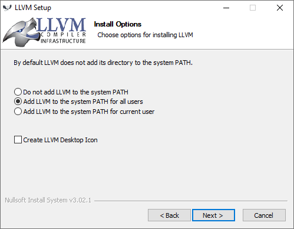

# How to add clang to your PATH in Windows

The clang compiler can be installed from a package downloaded from the [llvm site](https://releases.llvm.org/download.html) or from the [Visual Studio setup](https://visualstudio.microsoft.com/).

If you install clang from the llvm site then when installing you can select the option to add **LLVM** to system PATH.



If you have clang installed from the Visual Studio setup then **LLVM** directory is not in your PATH. You have to add **LLVM** directory to your PATH environment variable.

You can learn how to add something to your PATH from [https://superuser.com/a/284351](https://superuser.com/a/284351).

## Default locations for clang depending on installation method

[**LLVM**]

```C:\Program Files\LLVM\bin```

[**Visual Studio 2019 Community Edition**]

```C:\Program Files (x86)\Microsoft Visual Studio\2019\Community\VC\Tools\Llvm\x64\bin\```

[**Visual Studio 2019 Professional Edition**]

```C:\Program Files (x86)\Microsoft Visual Studio\2019\Professional\VC\Tools\Llvm\x64\bin\```

[**Visual Studio 2019 Enterprise Edition**]

```C:\Program Files (x86)\Microsoft Visual Studio\2019\Enterprise\VC\Tools\Llvm\x64\bin\```
